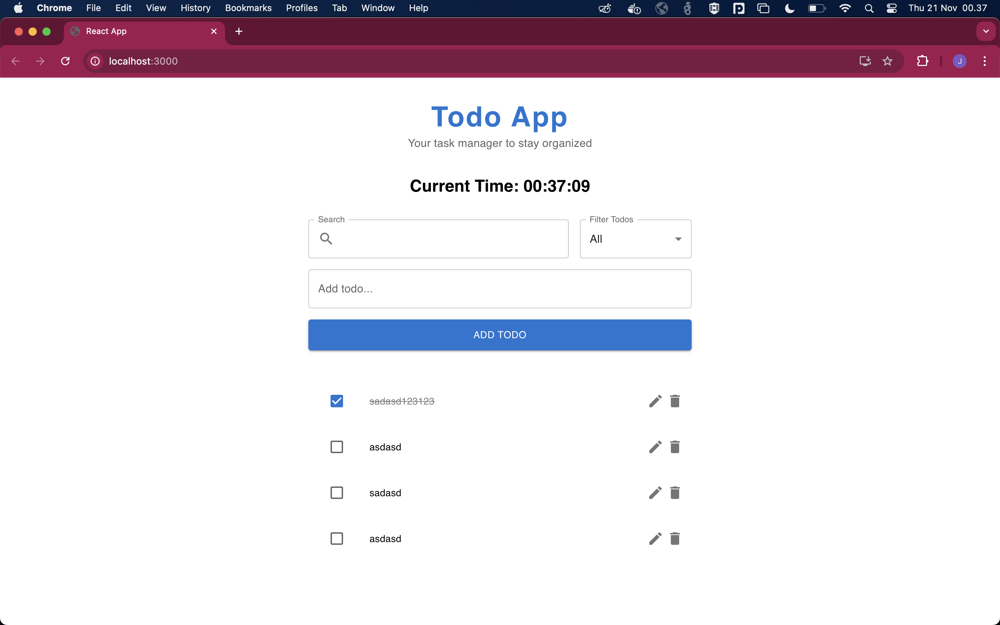

# Multi-Project Repository

This repository contains three distinct projects:

1. **Backend**: Built with [NestJS](https://nestjs.com/) to serve APIs.
2. **Problem Solving**: Solutions for three algorithmic challenges written in [Go](https://golang.org/).
3. **Frontend**: A web application developed with [ReactJS](https://reactjs.org/).

## Project Structure

├── backend/ # NestJS backend application 

├── problem-solving/ # Go solutions for algorithmic problems 

├── frontend/ # ReactJS frontend application

## Screenshot

